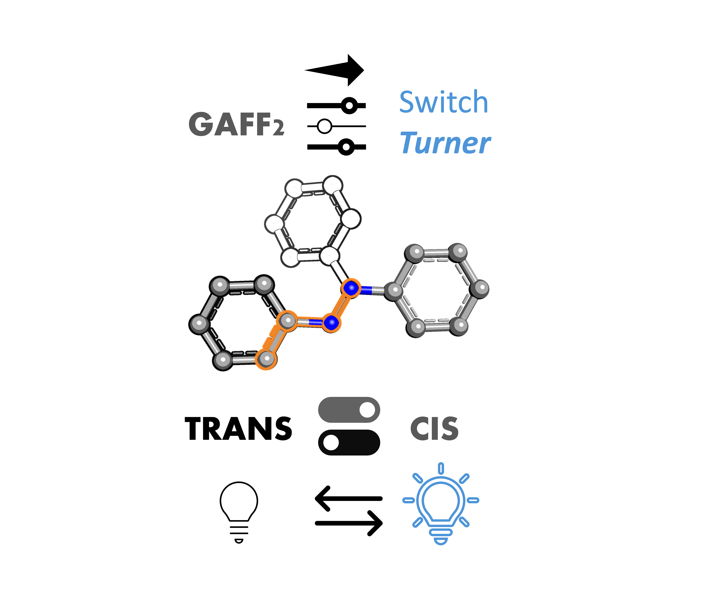

# Switch-Turner
Switch-Turner is a shell based code that re-parametrizes classical force field parameters via ORCA and Machine Learning Potentials yielding close to quantum accuracy  results. The code can be used a complete black box using merely a simple .mol2 file. This code has been created and is being developed by CompBioCat group in the University of Girona.

The script are still in development, and the main script will be coming out soon. Nevertheless we still offer some scripts that (with some manual work) may be helpful to re-parametrize your system's torsions. This includes a calculator of single-points via AMBER and the main fitter script that we are employing, that through the Molecular Mechanics and Reference Energy data generates fitted torsion parameters in the style of AMBER Force Fields.

Our goal is to be able to generate parameters that accurately describe photoswitches (mainly those derived from azobenzene) throughout a complete isomerization process, in essence (and for an azobenzene-like photoswitch) we can divide in 3 main parameters: trans- ; "TS" ; cis-. Fortunately, trans- and cis- parameters tend to be the same, or similar enough to be transferable. 

  

